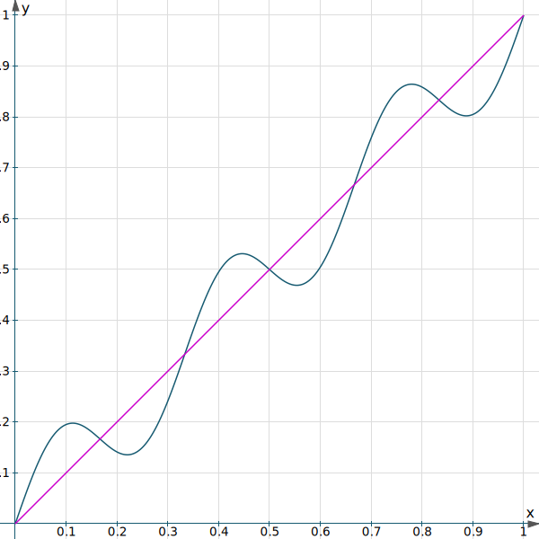

# rank-compare-approximations

## Rationale

Assume you have an expensive function `f` that, given something, returns a number. You don't particularly care about the output of `f`; you actually care about how it sorts (or ranks) some collection of inputs, that is, you care about `results` in the following:
```js
var inputs; // initialized to an array of something that `f` consumes
let results = inputs.map(f);
results.sort((a, b) => a - b);
```
(If you're confused by the argument to `sort`, welcome to one of JavaScript's [most surreal pitfalls](https://developer.mozilla.org/en-US/docs/Web/JavaScript/Reference/Global_Objects/Array/sort#Description).)

Now. You've come up with a clever approximation to `f`, called `f2`, that won't give exactly the same outputs as `f` but might be much faster to compute. `f2` might not even sort a collection of inputs in the same way as `f`.

***How good of an approximation is `f2` of `f`?***

In other words, how closely do elements of a set sort under two separate functions?

This little dependency-free library quickly lets you answer this question.

## Installation
This library is intended to be installed in Node.js (and potentially bundled for browsers via Browserify, etc.). Therefore, assuming you have [Node.js](https://nodejs.org) installed and an npm project initialized, run the following in the same directory as your npm project:
```
$ npm install --save rank-compare-approximations
```
(Consider replacing `--save` with `--save-dev` if this library will only be used to develop your npm project.)

Import the library into your JavaScript source or a Node terminal via:
```js
var compare = require('rank-compare-approximations');
```

## API

### `var result = compare(args, f, f2);`
Given
- `args: Array<T>`, that is, an array of some type `T`, and functions
- `f: T -> number` and
- `f2: T -> number`, that is, functions that, given some object of type `T` and returning a number,

the resulting `result: Array<number>` will be an array of numbers, the same length as `args`, whose elements tell you how many indexes away each element of `args` sorted according to `f` vs `f2`.

If `f2` is a great approximation to `f`, this will be an array entirely containing 0s: 0 is good, it means "zero sort (or rank) error". If `f2` occasionally mis-sorts (relative to `f`), some elements of the result will be non-zero, but most should be 0. If `f2` is a bad approximation of `f`, then few elements of the result will be zero.

Notionally:
```js
var y = args.map(f);
var y2 = args.map(f2);
var ySort = y.slice().sort((a, b) => a - b);
var y2Sort = y2.slice().sort((a, b) => a - b);
var result = args.map((_, i) => ySort.findIndex(arg => arg === y[i]) - y2Sort.findIndex(arg => arg === y2[i]));
```
The above is actually one way that this library is tested. It's slow because repeatedly calling `findIndex` like this is needlessly quadratic. The performance-minded reader will notice that we could create a `Map` to store the reverse-indexes, which is the other way that this library is tested. See [tests.js](tests.js).

The library actually implements something a little bit more clever than this: it sorts the sort indexes of `y` and `y2` above—there is no typo in this sentence. Thus, the runtime cost of the library (aside from the cost of invoking `f` and `f2`) is *four* sorts.

(This is "clever" in the algorithmic sense: it might not be immediately obvious why finding the sort indexes of the sort indexes of the mapping under `f` versus `f2` can be compared via subtraction, but some doodling with pen and paper will show you why it works. This implementation might be slower than something more straightforward using `Map`s as hinted above and implemented in the tests. My casual benchmarking showed that the library, using four sorts, was within 15% of the straightforward implementation.)

## Example

Consider an expensive function `var f = x => x + Math.sin(2 * Math.PI * 3 * x) * 0.1 + x` that you want to approximate using `var f2 = x => x`. The two are plotted below:



(Image courtesy of [intmath.com](https://www.intmath.com/functions-and-graphs/graphs-using-svg.php?function1=sin(2+*+pi+*+x+*+3)+*+0.1+%2B+x&function2=x&xMin=0&xMax=1&xGrid=.1&yMin=0&yGrid=.1&gwidth=600&gheight=600&equalScaling=equal).)

Clearly, `f` and `f2` will sort some areas of the x-axis the same but other areas differently, specifically, the areas where `f` is decreasing while `f2` stays increasing. The table below shows the index, the value of `x`, and the sort distance (the output of `compare`). The sort distance remains zero except for those portions where `f(x)` is decreasing, while `f2` fails to capture that.

| index | `x` | sort distance |
|---|---|---|
| 0 | 0 | 0 |
| 1 | 0.01 | 0 |
| 2 | 0.02 | 0 |
| 3 | 0.03 | 0 |
| 4 | 0.04 | 0 |
| 5 | 0.05 | 0 |
| 6 | 0.06 | 7 |
| 7 | 0.07 | 10 |
| 8 | 0.08 | 12 |
| 9 | 0.09 | 14 |
| 10 | 0.1 | 15 |
| 11 | 0.11 | 17 |
| 12 | 0.12 | 15 |
| 13 | 0.13 | 11 |
| 14 | 0.14 | 8 |
| 15 | 0.15 | 6 |
| 16 | 0.16 | 2 |
| 17 | 0.17 | -1 |
| 18 | 0.18 | -4 |
| 19 | 0.19 | -8 |
| 20 | 0.2 | -11 |
| 21 | 0.21 | -13 |
| 22 | 0.22 | -16 |
| 23 | 0.23 | -16 |
| 24 | 0.24 | -14 |
| 25 | 0.25 | -13 |
| 26 | 0.26 | -11 |
| 27 | 0.27 | -8 |
| 28 | 0.28 | -2 |
| 29 | 0.29 | 0 |
| 30 | 0.3 | 0 |
| 31 | 0.31 | 0 |
| 32 | 0.32 | 0 |
| 33 | 0.33 | 0 |
| 34 | 0.34 | 0 |
| 35 | 0.35 | 0 |
| 36 | 0.36 | 0 |
| 37 | 0.37 | 0 |
| 38 | 0.38 | 0 |
| 39 | 0.39 | 5 |
| 40 | 0.4 | 9 |
| 41 | 0.41 | 12 |
| 42 | 0.42 | 13 |
| 43 | 0.43 | 15 |
| 44 | 0.44 | 16 |
| 45 | 0.45 | 16 |
| 46 | 0.46 | 13 |
| 47 | 0.47 | 10 |
| 48 | 0.48 | 6 |
| 49 | 0.49 | 3 |
| 50 | 0.5 | 0 |
| 51 | 0.51 | -3 |
| 52 | 0.52 | -6 |
| 53 | 0.53 | -10 |
| 54 | 0.54 | -13 |
| 55 | 0.55 | -16 |
| 56 | 0.56 | -16 |
| 57 | 0.57 | -15 |
| 58 | 0.58 | -13 |
| 59 | 0.59 | -12 |
| 60 | 0.6 | -9 |
| 61 | 0.61 | -5 |
| 62 | 0.62 | 0 |
| 63 | 0.63 | 0 |
| 64 | 0.64 | 0 |
| 65 | 0.65 | 0 |
| 66 | 0.66 | 0 |
| 67 | 0.67 | 0 |
| 68 | 0.68 | 0 |
| 69 | 0.69 | 0 |
| 70 | 0.7 | 0 |
| 71 | 0.71 | 0 |
| 72 | 0.72 | 2 |
| 73 | 0.73 | 8 |
| 74 | 0.74 | 11 |
| 75 | 0.75 | 13 |
| 76 | 0.76 | 14 |
| 77 | 0.77 | 16 |
| 78 | 0.78 | 16 |
| 79 | 0.79 | 13 |
| 80 | 0.8 | 11 |
| 81 | 0.81 | 8 |
| 82 | 0.82 | 4 |
| 83 | 0.83 | 1 |
| 84 | 0.84 | -2 |
| 85 | 0.85 | -6 |
| 86 | 0.86 | -8 |
| 87 | 0.87 | -11 |
| 88 | 0.88 | -15 |
| 89 | 0.89 | -17 |
| 90 | 0.9 | -15 |
| 91 | 0.91 | -14 |
| 92 | 0.92 | -12 |
| 93 | 0.93 | -10 |
| 94 | 0.94 | -7 |
| 95 | 0.95 | 0 |
| 96 | 0.96 | 0 |
| 97 | 0.97 | 0 |
| 98 | 0.98 | 0 |
| 99 | 0.99 | 0 |

Code to produce the above:

```js
var f = x => Math.sin(2 * Math.PI * 3 * x) * 0.1 + x;
var f2 = x => x;
var N = 100;
var x = Array.from(Array(N), (_, i) => i / N);
var result = compare(x, f, f2);
x.forEach((x, i) => console.log(`| ${i} | ${x} | ${result[i]} |`));
```